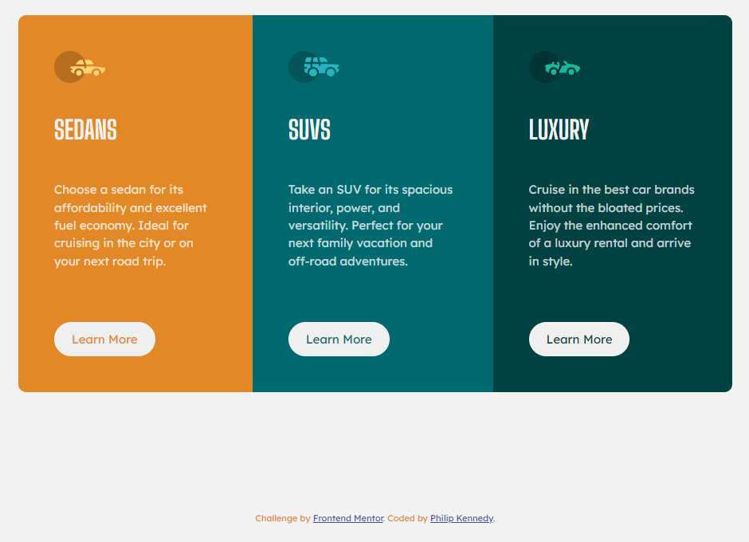

# Frontend Mentor - 3-Column Preview Card Component

This is my solution for the [3-Column Preview Card Component](https://www.frontendmentor.io/challenges/3column-preview-card-component-pH92eAR2-) (Newbie Challenge) on Frontend Mentor.

## Table of Contents

- [Overview](#overview)
  - [The Challenge](#the-challenge)
  - [Screenshot](#screenshot)
  - [Links](#links)
- [My Process](#my-process)
  - [Built with](#built-with)
  - [What I Learned](#what-i-learned)
  - [Useful Resources](#useful-resources)
- [Author](#author)

## Overview

### The Challenge

- **Difficulty -** `Newbie`

The challenge is to build out this 3-Column Preview Card Component and get it looking as close to the design as possible.

Your users should be able to:

- View the optimal layout depending on their device's screen size
- See hover states for interactive elements

### Screenshot

| Mobile                       | Desktop                       |
| ---------------------------- | ----------------------------- |
|  |  |

### Links

- **Solution URL -** [Frontend Mentor Solution](#)

- **Live Site URL -** [Live Site Preview (Vercel)](#)

## My Process

### Built with

- Semantic HTML5 markup
- CSS custom properties
- Flexbox

### What I Learned

Reinforcing previously learnt practices.

### Useful Resources

N/A

## Author

- **Github -** [PhlpKnndy](https://github.com/PhlpKnndy)
- **Frontend Mentor -** [PhlpKnndy](https://www.frontendmentor.io/profile/PhlpKnndy)
